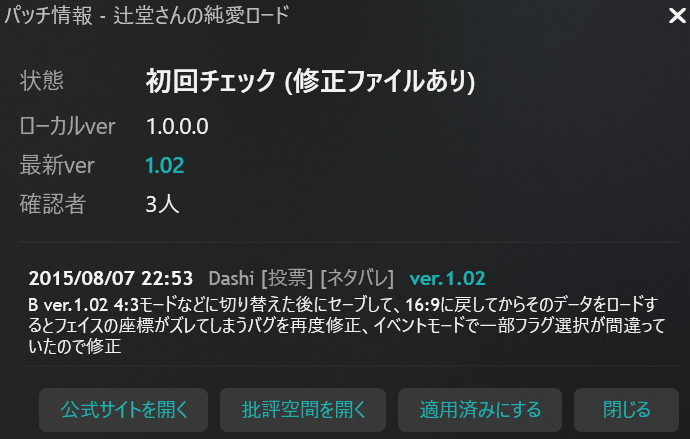

# VN Update Checker - Playnite Plugin

[批評空間（ErogameScape）](https://erogamescape.dyndns.org/)と[VNDB](https://vndb.org/)からビジュアルノベルのパッチ・アップデート情報を自動チェックし、Playnite上で通知するプラグインです。



## 機能

- **パッチ情報の自動チェック**: 批評空間のゲームページからパッチ情報（修正パッチ、アップデート）を取得
- **VNDB連携**: VNDBリンクから批評空間IDを自動解決、パッチリリース情報を補完
- **バージョン比較**: ローカルのexeバージョンとリモートの最新バージョンを比較し、更新の有無を判定
- **一括チェック**: ライブラリ内の全対象ゲームを一括でチェック
- **個別チェック**: ゲームの右クリックメニューから個別にチェック
- **キャッシュ機能**: チェック結果をキャッシュし、サーバーへの負荷を軽減
- **手動ID設定**: 批評空間IDの手動設定に対応
- **適用済み管理**: パッチ適用済みステータスの管理
- **タグ自動付与**: チェック結果に応じてPlayniteタグを自動付与

## インストール

### 手動インストール

1. [Releases](https://github.com/minuspiral/playnite-vn-update-checker/releases)から最新の`.pext`ファイルをダウンロード
2. Playniteでファイルを開く、または`Extensions`フォルダに展開

### ビルドからインストール

1. リポジトリをクローン
2. ビルド（後述）
3. `bin/Release/`フォルダの内容をPlayniteの拡張フォルダにコピー
   - 通常: `%AppData%/Playnite/Extensions/VNUpdateChecker/`

## 使い方

### 事前準備

Playniteのゲーム編集画面で「リンク」に批評空間またはVNDBのURLを追加してください。

- 批評空間: `https://erogamescape.dyndns.org/~ap2/ero/toukei_kaiseki/game.php?game=35825`
- VNDB: `https://vndb.org/v12345`（批評空間IDはVNDB APIから自動取得）

### パッチチェック

- **全ゲーム一括**: メインメニュー > `VN Update Checker` > `全ゲームのパッチ情報をチェック`
- **個別チェック**: ゲームを右クリック > `VN Update Checker` > `パッチ情報をチェック`

### その他の操作

- **批評空間ID手動設定**: ゲームを右クリック > `VN Update Checker` > `批評空間IDを手動設定`
- **パッチ適用済み**: ゲームを右クリック > `VN Update Checker` > `パッチ適用済みにする`
- **キャッシュクリア**: メインメニュー > `VN Update Checker` > `キャッシュをクリア`

### 設定

プラグイン設定画面で以下を変更できます：

- **キャッシュ有効期間**: チェック結果のキャッシュ保持時間（デフォルト: 24時間）

## ビルド方法

### 前提条件

- .NET SDK 8.0以上
- .NET Framework 4.6.2 Targeting Pack

### ビルド

```bash
dotnet build VNUpdateChecker.sln -c Release
```

出力先: `bin/Release/`

### パッケージング

```bash
Toolbox.exe pack "bin/Release" "dist"
```

## 技術情報

- **フレームワーク**: .NET Framework 4.6.2
- **SDK**: PlayniteSDK 6.11.0
- **HTML解析**: HtmlAgilityPack 1.11.54
- **プラグイン種別**: GenericPlugin

## 注意事項

- 批評空間へのアクセスにはレート制限（2.5秒間隔）を設けています。大量のゲームをチェックする場合は時間がかかります。
- VNDB APIへのアクセスにもレート制限（1.5秒間隔）を設けています。
- 批評空間のHTML構造が変更された場合、パーサーが正常に動作しない可能性があります。

## ライセンス

[MIT License](LICENSE)
